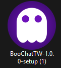
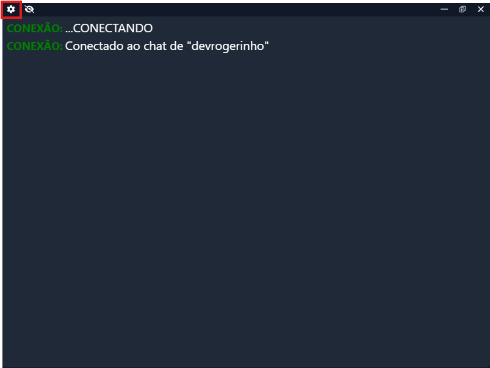
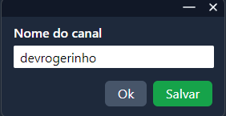
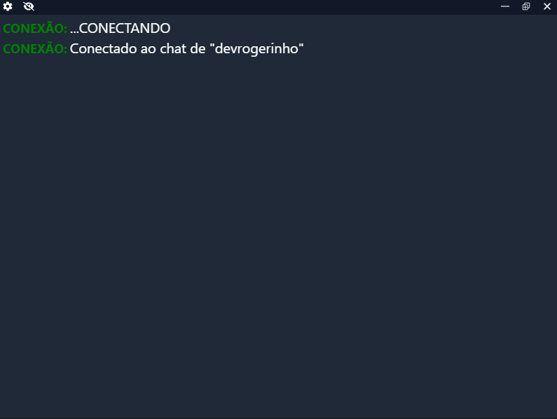
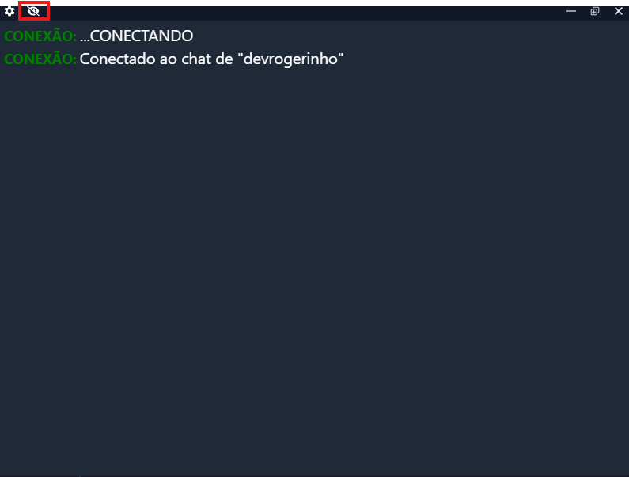

# BooChatTW

 captura o chat da Twitch e o exibe de forma transparente na tela. Ideal para streamers que desejam sobrepor o chat nas transmissões sem fundo sólido, permitindo melhor integração com o jogo ou conteúdo exibido.

## Recommended IDE Setup

- [VSCode](https://code.visualstudio.com/) + [ESLint](https://marketplace.visualstudio.com/items?itemName=dbaeumer.vscode-eslint) + [Prettier](https://marketplace.visualstudio.com/items?itemName=esbenp.prettier-vscode)

## Project Setup

### Install

```bash
$ pnpm install
```

### Development

```bash
$ pnpm dev
```

### Build

```bash
# For windows
$ pnpm build:win

# For macOS
$ pnpm build:mac

# For Linux
$ pnpm build:linux
```

## BooChatTW

BooChatTW captura o chat da Twitch e o exibe de forma transparente na tela. Ideal para streamers que desejam sobrepor o chat nas transmissões sem fundo sólido, permitindo melhor integração com o jogo ou conteúdo exibido.

# Download

- Executável (.exe): BooChatTW 1.0.0 - Setup

- Versão sem instalação (win-unpacked): BooChatTW Unpacked

## Como Utilizar

- Baixe e instale o executável.

- Abra o aplicativo.



- Acesse a seção Configurações e insira o nome do canal da Twitch.




- Pronto! O chat será capturado e exibido automaticamente na tela.



- Para deixar o chat Transparent ou fazê-lo voltar a aparecer você pode usar ```CTRL + ALT + A``` ou clicar no olhinho

