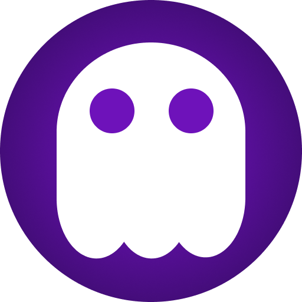
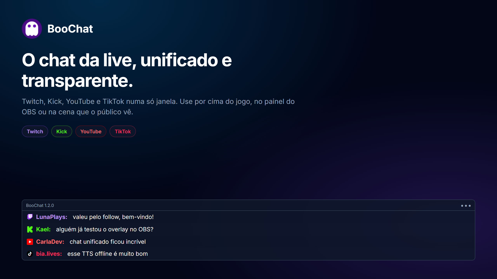
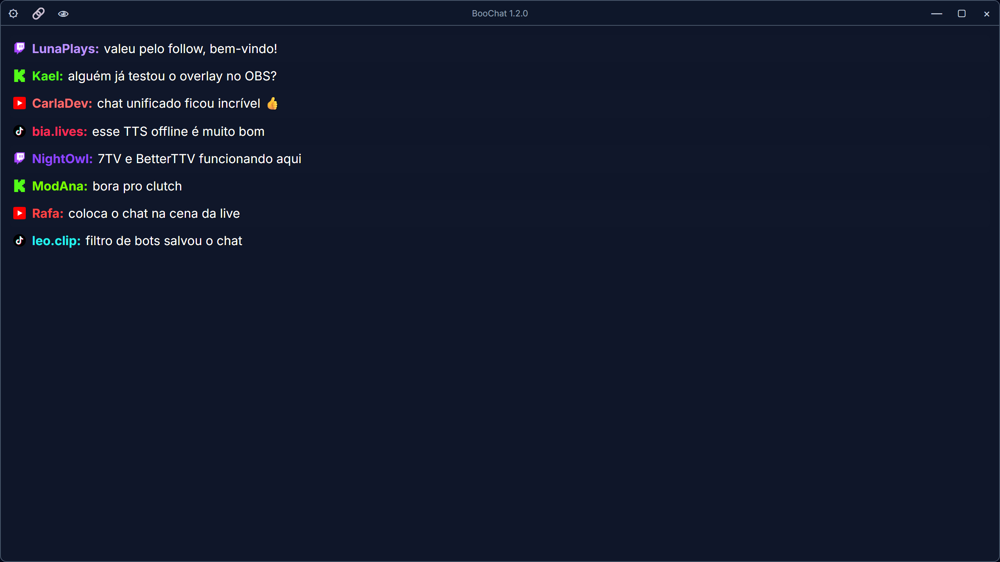
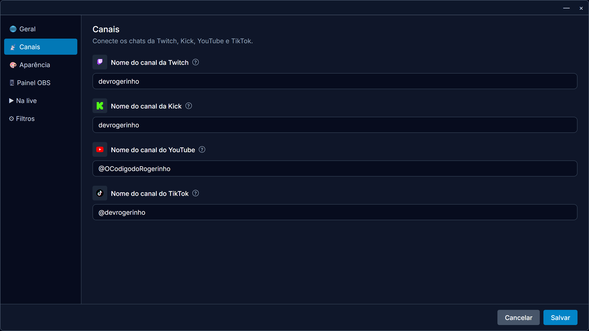
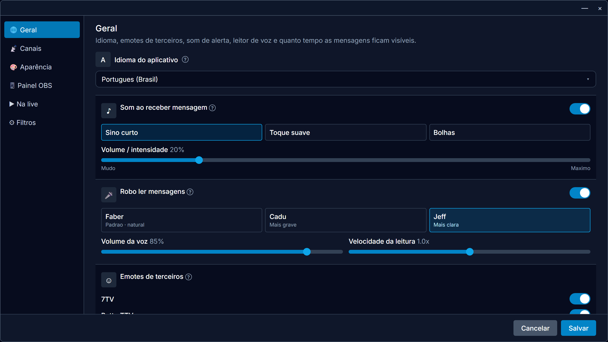
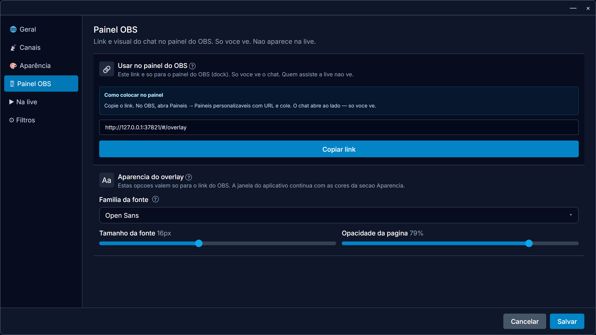
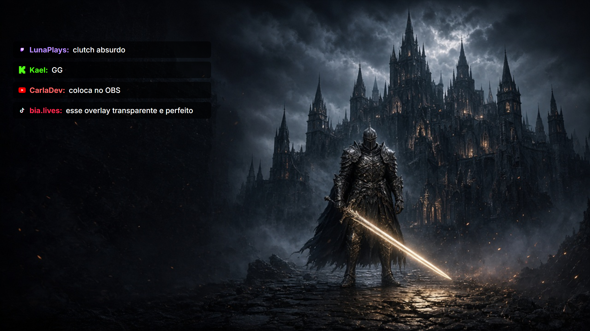

<p align="center">
  
</p>

<h1 align="center">BooChat</h1>

<p align="center">
  Chat unificado para streamers.<br />
  Twitch, Kick, YouTube e TikTok numa só janela — transparente, no OBS e na live.
</p>

<p align="center">
  <a href="https://github.com/0rogerinho/boo-chat-tw/releases/latest"><strong>Baixar agora</strong></a>
  ·
  <a href="https://github.com/0rogerinho/boo-chat-tw/releases">Todas as versões</a>
</p>

<p align="center">
  
  
  
  
</p>



---

## Para que serve

Quem transmite em mais de uma plataforma não precisa abrir quatro chats. O BooChat junta as mensagens da **Twitch**, **Kick**, **YouTube** e **TikTok**, deixa a janela transparente por cima do jogo e envia o mesmo chat para o OBS.

Não pede API key. Instala, coloca o nome dos canais e o chat começa a aparecer.

## Chat unificado

As quatro plataformas na mesma lista. Cada mensagem mostra de onde veio, com nick colorido, badges e emotes.



## Conecte os canais

Twitch e Kick pelo nome do canal. YouTube aceita `@handle` ou a URL da live. TikTok pode ser com ou sem `@`.



## Som, TTS e emotes

Na aba **Geral** você escolhe o idioma, o alerta sonoro, o leitor de voz offline (Faber, Cadu ou Jeff) e liga 7TV / BetterTTV.

O TTS lê as mensagens no seu computador. Não envia o chat para a nuvem.



## Painel do OBS

Um link local só para o dock. Você acompanha o chat no OBS; quem assiste a live **não vê**.

Aparência própria: fonte, tamanho e opacidade só deste painel.



## Overlay na live

Outro link, para a fonte de navegador da cena. Fundo transparente, por cima do jogo. Quem assiste vê o chat no vídeo.



## O que tem no app

| Recurso | O que faz |
| --- | --- |
| **Chat unificado** | Twitch, Kick, YouTube e TikTok na mesma janela |
| **Janela transparente** | Sobreponha o chat no jogo. Atalho `Ctrl + Alt + A` para mostrar ou esconder |
| **Painel do OBS** | Link local só para o dock — só você vê |
| **Chat na cena** | Fonte de navegador com fundo transparente — o público vê |
| **TTS offline** | Vozes Faber, Cadu e Jeff. Lê no seu PC, sem nuvem |
| **Sons de alerta** | Sino, toque suave ou bolhas. Volume e mute na hora |
| **Emotes extras** | 7TV e BetterTTV na Twitch, além dos nativos |
| **Imagens e GIFs** | Links de imagem, TWShot, Lightshot, Imgur e Tenor |
| **Filtro de bots** | Nightbot, StreamElements, Moobot e a lista que você quiser |
| **Aparência por contexto** | Fonte e fundo separados para a janela, o painel e a live |
| **Mensagens que somem** | Avisos e mensagens dos viewers podem desaparecer depois de alguns segundos |
| **6 idiomas** | Português, inglês, espanhol, francês, alemão e italiano |
| **Atualização automática** | Avisa quando sai versão nova e atualiza com um clique |

## Como usar

1. [Baixe a versão mais recente](https://github.com/0rogerinho/boo-chat-tw/releases/latest) e instale.
2. Abra o BooChat e vá em **Configurações → Canais**.
3. Coloque os canais da Twitch, Kick, YouTube e/ou TikTok. Salve.
4. O chat unificado aparece na janela. Use o ícone de olho ou `Ctrl + Alt + A` para deixar transparente.

### Dois jeitos no OBS

O app sobe um servidor local em `127.0.0.1` enquanto está aberto. São dois links diferentes, de propósito.

**Painel (dock)** — só você vê. No OBS: Painéis → Painéis personalizáveis com URL → cole o link do **Painel OBS**.

**Cena da live** — o público vê. No OBS: Adicionar → Fonte → Navegador → cole o link de **Na live**, marque fundo transparente e arraste o chat para o lugar certo.

O BooChat precisa ficar aberto para o overlay funcionar.

## Download

| Sistema | Arquivo |
| --- | --- |
| **Windows** | Instalador (`BooChat-1.2.1-windows-setup.exe`) ou versão portable |
| **macOS** | DMG para Intel e Apple Silicon |
| **Linux** | AppImage, DEB ou RPM |

Tudo está na [página de releases](https://github.com/0rogerinho/boo-chat-tw/releases/latest).

## Para desenvolver

```bash
pnpm install
pnpm dev
```

```bash
pnpm run build:win    # Windows
pnpm run build:mac    # macOS
pnpm run build:linux  # Linux
```

Electron, React, TypeScript e Tailwind. Node.js 18+ e pnpm.

---

Feito por [devrogerinho.com](https://devrogerinho.com) · [código no GitHub](https://github.com/0rogerinho/boo-chat-tw)
